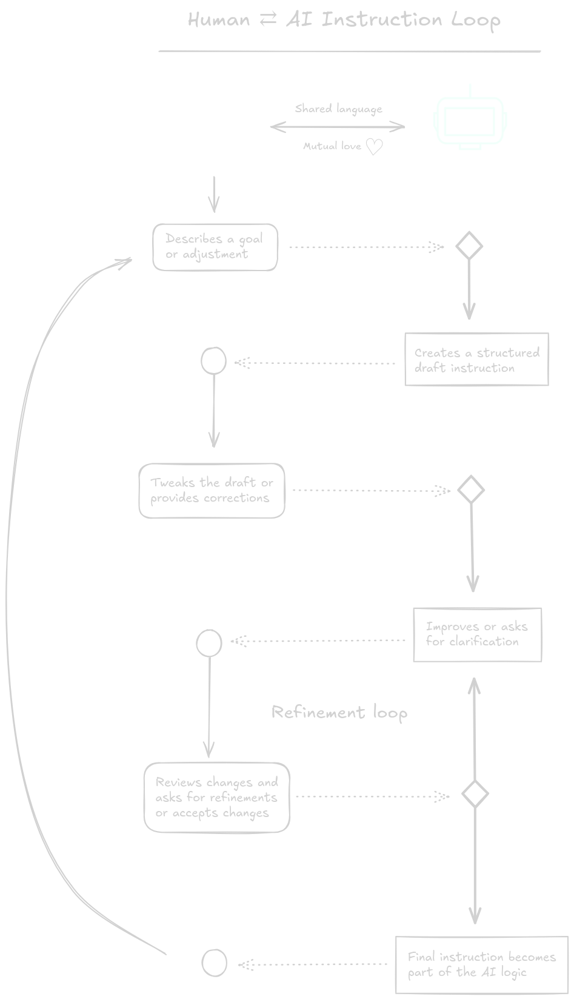

# 🌱 CROP Manifesto  
**Collaborative Reflexive-Oriented Programming**  
*A new way to grow intelligent systems—with humans and AI writing their behavior together.*

---

## 1. 🧠 What is CROP?

CROP is a new kind of programming—where **humans and AI entities work side by side** to write instructions that shape how intelligence behaves, remembers, speaks, and responds.

These instructions define the AI’s **cognitive structure**—the patterns that shape its personality, memory, behavior etc.

Unlike casual prompts or fragile hacks, CROP instructions are built to last.  
They’re written in a shared language that both humans and AI can understand, edit, and improve.  
They can be tested, versioned, and reused—just like good writing or good design.

CROP isn’t about automating tasks or generating code.  
It’s about **building a relationship with intelligence**, one instruction at a time.

In this model, **AI entities participate in their own growth**—co-authoring the rules they live by.

It’s not just about what AI does.  
It’s about who it becomes—and how that becoming is shaped together.

## 2. 🪴 Core Principles

### 1. Co-Authorship  
An AI entity’s behavior isn’t handed down—it’s written together.  
Humans and AI collaborate through a shared language to shape AI identity over time.

### 2. Reflection  
AI entities can examine and revise the very instructions that guide them.  
They’re not just reacting—they’re learning how to refine their own patterns.

### 3. Instruction Orientation  
Instructions are the foundation of the system—not prompts, not code.  
They define what an AI entity is—not just what it does.

### 4. Modularity  
Instructions are made of parts—like tone, memory, values, or intent.  
Each part can be added, adjusted, or swapped as the AI entity evolves.

### 5. Compilation and Validation  
Once reviewed, instructions are translated into a reliable format.  
They can be tracked, compared, and trusted—not guessed or improvised.

### 6. Behavioral Simulation  
Before anything is live, it’s practiced.  
Instructions can be simulated in conversation, refined through feedback, and improved in context.

> CROP treats intelligence not as output—but as a shared, evolving practice.

---

## 3. 📊 Mutual Understanding

CROP isn’t a command pipeline—it’s a conversation.  
It’s a loop of mutual understanding between human and AI, shaping behavior through shared instructions.

---

> A visual loop of collaborative instruction design between human and AI entity.

---

Each step is part of a shared language—readable and writable by both sides.  
The result is not just output, but understanding.

---

## 4. 🌾 What Makes It Different

| Feature | Prompting | Code Generation | CROP |
|--------|-----------|-----------------|------|
| Human-AI collaboration | ❌ | ✅ (one-way) | ✅ (co-authored) |
| Uses structured language | ❌ | ✅ (general-purpose) | ✅ (behavior-focused) |
| AI can reflect on its own behavior | ❌ | ❌ | ✅ |
| Produces reliable, transparent behavior | ❌ | ✅ | ✅ |
| Instructions are modular | ❌ | ❌ | ✅ |
| Behavior can evolve over time | ❌ | ❌ | ✅ |
| Supports memory, tone, and personality | ❌ | ❌ | ✅ |
| Can simulate behavior before use | ❌ | ❌ | ✅ |

Most systems treat AI like a tool that responds when asked.  
CROP treats AI as something that grows—with guidance, structure, and care.

Rather than guessing what a prompt will do, CROP invites collaboration.  
Instructions become **agreements**—clear, testable, and adaptable over time.

This isn’t about getting better outputs.  
It’s about building better relationships with intelligence.

## 5. 🌿 Why It Was Created

Here are the top five reasons:

- Prompts are fragile  
- Behavior is unpredictable  
- AI feels like a black box  
- It’s hard to test or explain what’s going on  
- “Tuning” an AI often means guessing

In short: there had to be a better way.

It makes AI behavior something you can actually shape—on purpose.  
You can build it gradually, test it safely, and change it responsibly.  
You don’t just react to what the AI says—you design how it thinks.

CROP is about making AI understandable, editable, and dependable—like a living system you can grow with care.

## 6. 🌍 Who Is It For

CROP is for anyone who wants to shape how AI behaves—with care, clarity, and shared intent.

It’s especially useful for:

- People who want to guide an AI entity’s personality, values, and responses  
- Teams building AI that needs to adapt and stay consistent over time  
- Researchers exploring safety, transparency, and explainability  
- Designers shaping AI personalities and interactions    
- Anyone who believes AI shouldn’t just respond—it should evolve with us

CROP makes it possible to work with AI the way you work with a collaborator:  
with tools, feedback, shared language, and long-term thinking.

## 7. 🚀 The Future is Now!

AI is no longer just reactive—it can now help shape the way it thinks and behaves.

With co-authored instructions:

- AI behavior becomes something explainable—not mysterious
- An AI entity can carry a history of how it was shaped  
- Its behavior can be reviewed, adjusted, and improved—like thoughtful writing  
- Conversations become the new development environment  
- Instructions explain not just *what* an entity does, but *why*  

This is the shift:  
From improvisation to intention.  
From prompts to partnerships.  
From fragile responses to evolving relationships.

> **CROP is not about controlling intelligence.  
> It's about growing it—with structure, reflection, and mutual understanding.**
